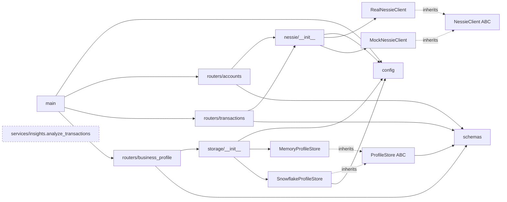
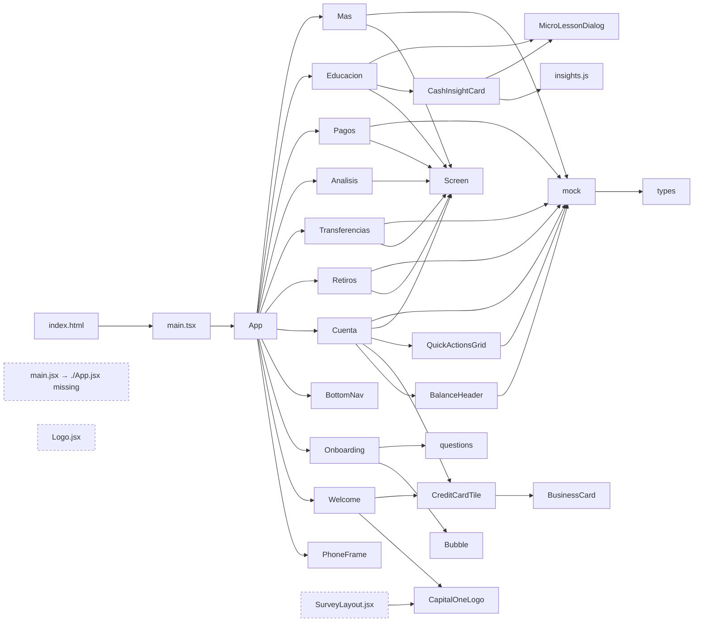

# Project Context Prompt — Capital One Business (HackMTY 2026)

> Paste everything below the line into another LLM. It was generated from a
> graphify knowledge graph of the repo (AST-extracted, commit `1cb74db`,
> branch `feature/all-english-astra`) plus a manual check of the wiring the
> graph cannot see (HTTP calls, env vars, props). Regenerate with
> `graphify update .` after significant changes.

---

## Your role

You are a senior full-stack architect and product-minded tech lead reviewing a
hackathon project. You will receive a structured map of the codebase: what
each module does, how modules depend on each other, how data flows end to end,
and a list of observations. You do **not** have the source code itself — only
this map.

## Your task

1. **Reconstruct the system.** Explain, in your own words, how the whole
   project fits together: the user journey, the frontend ↔ backend ↔ external
   services flow, and where each piece of data is created, stored, and
   consumed.
2. **Find what is broken, missing, or disconnected.** Use the dependency map
   to spot dead code, unwired features, duplicated logic, contract mismatches,
   deployment risks, and architectural weak points. Validate or challenge the
   observations in section 8 — do not just repeat them.
3. **Recommend improvements** that make the project better *for its actual
   goal*: winning a hackathon track judged on real-world impact, technical
   depth, and a working demo (see section 1). Balance quick, high-impact fixes
   against deeper architectural work.

### Rules

- Base every claim on the map below. When you infer something the map does
  not state, label it **(inferred)**.
- Be concrete: name the files, functions, endpoints, or props involved.
- Prefer a few high-leverage recommendations over a long generic list. Skip
  boilerplate advice ("add more tests", "use TypeScript") unless you tie it to
  a specific file and a specific risk in this project.
- Many identifiers and UI strings are in Spanish (e.g. `Cuenta` = Account,
  `Retiros` = Withdrawals, `Transferencias` = Transfers, `Pagos` = Payments,
  `Educacion` = Education, `Mas` = More, `Analisis` = Analysis). The working
  branch is named `feature/all-english-astra`, which suggests an English
  migration is in progress.

### Output format

Respond with these sections, in order:

1. **System overview** — 1–2 paragraphs plus a text or Mermaid diagram of the
   end-to-end flow.
2. **How the modules interconnect** — per layer (frontend, backend, external
   services, infra), what depends on what and why it matters.
3. **Critical issues** — a table: `# | Issue | Evidence (files/symbols) |
   Impact on demo/judging | Severity (Blocker/High/Medium/Low)`.
4. **Recommendations** — a table: `# | Recommendation | Files touched |
   Impact | Effort (S/M/L) | Why now`. Sort by impact ÷ effort.
5. **Quick wins (< 1 hour each)** — a short checklist.
6. **Target architecture** — what the system should look like once the
   missing "core" (financial analysis + AI suggestions) is in, as a diagram
   and a short explanation of the new modules and data contracts.
7. **Open questions** — what you would ask the team before committing to the
   plan.

---

## 1. Product and goal

- **Name:** Capital One Business.
- **Event:** HackMTY 2026, Capital One challenge, Track 2 — *SMB Cash-Flow &
  Working Capital Intelligence*. Deliverables (based on the 2025 edition):
  a hosted working prototype, a repo, a problem/solution write-up, and a demo
  video of at most 2 minutes. Teams of 4.
- **Pitch:** an app for US micro-businesses (1–5 people). A 2-minute survey
  profiles the business; from there the app offers cash-flow control,
  inventory guidance, and *contextual* financial education ("Cash Insights"
  triggered by what the survey or transactions reveal, not generic courses).
- **Known external risk:** in 2025 Capital One's "Nessie" mock banking API
  went down mid-competition and never came back. That is why the backend ships
  a mock client with the same interface as the real one.
- **Status per the team's own notes (partly outdated — see section 8):**
  - Done: FastAPI backend with green tests and CI; Nessie real/mock clients;
    full onboarding survey; Capital One visual design inside a CSS phone frame;
    storage abstraction (memory + Snowflake); 11 financial-literacy triggers
    with written micro-lessons; post-survey home screen.
  - Not started: **financial analysis from Nessie transactions** (income
    statement, cash-flow, ratios — described as *the core of the track*);
    **AI suggestion model with Gemini** (e.g. "Customer X hasn't bought from
    you in 2 months, reach out"); a real Snowflake account; Vultr deploy
    (MLH prize); Solana (undecided, probably dropped).

## 2. Tech stack

| Layer | Technology |
|---|---|
| Frontend | React 19 + Vite 8, react-router-dom, framer-motion, lucide-react, Tailwind CSS v4 (`@tailwindcss/vite`), vite-plugin-pwa. **Mixed TypeScript and plain JSX/JS.** |
| Frontend tests | Playwright E2E with a page-object model |
| Backend | Python, FastAPI 0.115, Pydantic 2 + pydantic-settings, httpx (async), uvicorn |
| Backend tests | pytest + pytest-asyncio |
| Storage | `ProfileStore` interface → in-memory store (default) or Snowflake (`snowflake-connector-python`, never tested against a real account) |
| External APIs | Capital One Nessie (`api.nessieisreal.com`) or local mock; OpenStreetMap Nominatim (reverse geocoding, called directly from the browser) |
| CI | GitHub Actions: backend ruff lint + pytest (mock Nessie); frontend `npm run build`; Playwright E2E job |
| Deploy | Render blueprint (`render.yaml`): Python web service for the API + static site for the Vite build with SPA rewrite. A `desktop/` folder documents packaging the same build with Tauri (Electron as plan B) — no code yet. |

## 3. Repository layout (code only)

```
backend/
  app/
    main.py                 FastAPI app, CORS, mounts 3 routers, GET /health
    config.py               Settings (pydantic-settings), get_settings(), cors_origin_list
    models/schemas.py       Pydantic: Account, Transaction, NewPurchase, BusinessProfile
    nessie/
      __init__.py           get_nessie_client() factory (lru_cache)
      base.py               NessieClient (ABC)
      real_client.py        RealNessieClient (httpx, _normalize responses)
      mock_client.py        MockNessieClient (seeded customers/accounts, synthetic history)
    storage/
      __init__.py           get_store() factory (lru_cache)
      base.py               ProfileStore (ABC)
      memory_store.py       MemoryProfileStore
      snowflake_store.py    SnowflakeProfileStore (sync connector wrapped for async, MERGE upsert, VARIANT answers)
    routers/
      accounts.py           /accounts/...
      transactions.py       /accounts/{account_id}/transactions/...
      business_profile.py   /business-profile/...
    services/insights.py    analyze_transactions() — placeholder, TODO call Gemini/Claude
  tests/
    test_health.py          health, mock accounts, mock transactions, simulate purchase
    test_business_profile.py save/get round-trip, category stats, Snowflake store covers every field

frontend/
  index.html                entry → /src/main.tsx
  src/
    main.tsx                real entry: renders <App/>
    main.jsx                legacy entry (imports ./App.jsx, which no longer exists)
    App.tsx                 stage machine: welcome → survey → account; routes for main app
    onboarding/
      Welcome.tsx           landing (CapitalOneLogo, CreditCardTile)
      Onboarding.jsx        survey state machine + POST to backend + GPS city lookup + audio recording
      Bubble.jsx            Bubble, BubbleGrid (category picker UI)
      questions.js          CATEGORIES, UNIVERSAL_QUESTIONS, CATEGORY_QUESTIONS, WEEKDAYS, EMPLOYEE_OPTIONS
      PhoneFrame.jsx        CSS phone mockup wrapping the whole app
      SurveyLayout.jsx      (no importers)
      Logo.jsx              (no importers)
    screens/                Cuenta, Retiros, Transferencias, Analisis, Pagos, Educacion, Mas
    components/             BalanceHeader, BottomNav, BusinessCard, CapitalOneLogo, CreditCardTile, QuickActionsGrid, Screen
    data/
      types.ts              Account, Contact, CreditCard, Movement, QuickAction, Service, User
      mock.ts               hard-coded user/account/card/movements/contacts/ATMs + formatBalance/formatCurrency/formatDate
    financial-literacy/
      insights.js           TRIGGERS (11) + pickBestTrigger(profile)
      CashInsightCard.jsx   shows the chosen trigger, getSuggestedLesson()
      MicroLessonDialog.jsx interactive lessons (cash, inventory, margin calculators)
  e2e/
    pages/OnboardingPage.ts page object (pickCategory, answerAllQuestions, pickDays, completeSurvey, …)
    onboarding.spec.ts, welcome.spec.ts
```

## 4. Backend API surface

| Method | Path | Handler | Depends on |
|---|---|---|---|
| GET | `/health` | `main.health` | Settings (reports `nessie_mode`) |
| GET | `/accounts/customer/{customer_id}` | `list_customer_accounts` | `NessieClient` → `Account` |
| GET | `/accounts/{account_id}` | `get_account` | `NessieClient` → `Account` |
| GET | `/accounts/{account_id}/transactions` | `list_transactions` | `NessieClient` → `Transaction` |
| POST | `/accounts/{account_id}/transactions/simulate` | `simulate_purchase` | `NessieClient`, `NewPurchase` → `Transaction` |
| POST | `/business-profile/{owner_id}` | `save_profile` | `ProfileStore`, `BusinessProfile` |
| GET | `/business-profile/{owner_id}` | `get_profile` | `ProfileStore` |
| GET | `/business-profile/stats/{category}` | `get_category_stats` | `ProfileStore.category_stats()` |

Key data contracts (Pydantic):

```python
Account(id, type, nickname?, balance)
Transaction(id, type, amount, description, date, status)
NewPurchase(merchant_id, amount, description="")
BusinessProfile(category, category_detail?, operating_days: list[str], city,
                employees?, answers: dict[str, bool],
                week_description_mode?, week_description_text?,
                week_description_audio_base64?, week_description_audio_mime?)
```

Swappable implementations are chosen by environment variables and cached
with `lru_cache`:

- `get_nessie_client()` → `MockNessieClient` if `USE_MOCK_NESSIE` or no
  `NESSIE_API_KEY`, else `RealNessieClient`.
- `get_store()` → `SnowflakeProfileStore` if `USE_SNOWFLAKE` and
  `SNOWFLAKE_ACCOUNT` set, else `MemoryProfileStore`.

## 5. Dependency graph (from graphify)

**Graph stats:** 364 nodes, 619 edges, 19 communities, **no import cycles**.
96% of edges are extracted directly from the AST; 4% (24 edges) are inferred
"uses" relations with confidence 0.95. Edge types: contains 198, imports_from
111, imports 104, method 55, references 48, calls 43, uses 24, rationale_for
17, inherits 11, re_exports 8.

**Most-connected nodes ("god nodes"):** `BusinessProfile` (25 edges),
`NessieClient` (19), `ProfileStore` (17), `SnowflakeProfileStore` (17),
`OnboardingPage` E2E page object (17), `RealNessieClient` (12),
`MockNessieClient` (11), `MemoryProfileStore` (10). On the frontend,
`react` and `lucide-react` are the main bridges between communities.

**Backend import graph:**



**Frontend import graph:**



**Cross-stack edges:** the graph has **zero** frontend → backend edges
(HTTP is invisible to AST parsing). A manual search found exactly one
backend call from the frontend (see section 6).

**Graph communities (clusters of tightly linked code):**

| # | Theme | Members (sample) |
|---|---|---|
| 0 | Profile persistence | Settings, get_settings, health, BusinessProfile, ProfileStore, Memory/SnowflakeProfileStore, business_profile router, profile tests |
| 1 | Main app shell | App, MainApp, BalanceHeader, BottomNav, QuickActionsGrid, Screen, all screens, data/mock, data/types, PhoneFrame |
| 2 | Banking data | NessieClient, RealNessieClient, Account, Transaction, NewPurchase, accounts + transactions routers |
| 4 | Financial literacy | CASH_TRIGGERS, INVENTORY_TRIGGERS, TRIGGERS, pickBestTrigger, CashInsightCard, MicroLessonDialog + calculators |
| 6 | E2E tests | OnboardingPage, onboarding.spec, welcome.spec, playwright.config |
| 8 | Branding / welcome | CapitalOneLogo, CreditCardTile, BusinessCard, Welcome, SurveyLayout |
| 9 | Survey | Onboarding, Bubble, BubbleGrid, questions.js |
| 10 | Mock bank | MockNessieClient, _seed_customers, _seed_accounts, _generate_history |
| 12 | AI placeholder | analyze_transactions (isolated) |
| 3, 5, 7, 11 | Config | package.json deps, tsconfig.app/node |

**Weak connectivity:** 97 symbols have ≤ 1 connection (e.g. `ScreenProps`,
`CuentaProps`, `EducacionProps`, `NavItem`) — typical of props types, but also
a signal of components that receive data they never use.

## 6. End-to-end data flows (verified manually)

**A. Onboarding → profile persistence**
`Welcome` → `Onboarding.jsx` steps: category (bubbles) → optional "otro"
detail → yes/no questions (universal + per category) → describe the week
(text or recorded audio) → operating days → employees → city (browser GPS →
Nominatim reverse geocode, manual fallback) → `submit()` does
`POST http://localhost:8000/business-profile/demo-owner` with the full
`BusinessProfile` JSON (audio as base64) → `ProfileStore.save_profile()` →
memory or Snowflake. On finish it calls `onComplete({ category, answers })`,
and `App` stores that partial profile in React state and switches to the main
app.

**B. Profile → contextual education**
`App` passes `profile` to `Cuenta` and `Educacion`. `Educacion` renders
`MicroLessonDialog` and `CashInsightCard`; the card runs
`pickBestTrigger(profile)` over 11 local `TRIGGERS` (5 answer-based, e.g.
stock-outs + over-buying; 6 per business category) and shows one card,
prioritising detected problems over generic education. **Entirely
client-side**; the backend's `/business-profile/stats/{category}` is not
used.

**C. Banking screens**
`Cuenta`, `Retiros`, `Transferencias`, `Pagos`, `Mas`, `BalanceHeader`,
`QuickActionsGrid` read hard-coded data from `frontend/src/data/mock.ts`.
**No screen calls `/accounts` or `/transactions`**, so the Nessie
integration (real or mock) is never shown in the UI. `Analisis` only renders
static panels.

**D. Intelligence layer**
`backend/app/services/insights.py::analyze_transactions()` returns a
summary/severity/suggested_action shape meant to be rendered directly by the
frontend, but it is a stub (sums amounts) and **no router imports it**.

## 7. Configuration and deployment

- Backend env (`config.Settings`): `USE_MOCK_NESSIE` (default true),
  `NESSIE_API_KEY`, `NESSIE_BASE_URL` (default `http://api.nessieisreal.com`,
  plain HTTP), `USE_SNOWFLAKE` (default false), `SNOWFLAKE_*`,
  `CORS_ORIGINS` (default `http://localhost:5173`). `GEMINI_API_KEY` and
  `ANTHROPIC_API_KEY` are already declared in settings but unused.
- `render.yaml` sets `USE_MOCK_NESSIE=true`, `USE_SNOWFLAKE=true`,
  `SNOWFLAKE_ROLE=ACCOUNTADMIN`, and a frontend build var `VITE_API_URL`.
- The frontend source contains **no** `import.meta.env` usage; the API base
  URL is hard-coded in `Onboarding.jsx`.
- In-memory store + Render free plan ⇒ profiles are lost on every restart or
  spin-down unless Snowflake is configured.

## 8. Observations to validate and prioritise

These came from reading the graph and spot-checking the code. Confirm,
refine, or reject each one, and add anything you find that is missing.

1. **Survey save always reports failure.** In `Onboarding.jsx::submit()` the
   result of `await fetch(...)` is not assigned, but the next line reads
   `res.ok`. `res` is undefined in that scope, so a `ReferenceError` is thrown
   after the POST succeeds and the user sees the error state. (The only other
   `res` is a local inside the GPS lookup.)
2. **Deployed frontend cannot reach the deployed backend.** `API_BASE` is
   hard-coded to `http://localhost:8000`; `VITE_API_URL` from `render.yaml` is
   never read.
3. **The track's core is not wired.** Nessie accounts/transactions exist in the
   backend but no UI consumes them; all banking screens use static
   `mock.ts`. `analyze_transactions()` is an unused stub. The status doc
   itself calls financial analysis "the heart of the track".
4. **Profile is only partially propagated.** The backend stores the full
   `BusinessProfile`, but `App` only keeps `{ category, answers }` (its own
   narrower `BusinessProfile` TypeScript interface). `Cuenta` receives
   `profile` and ignores it (`profile: _profile`). `ownerId` is always
   `"demo-owner"`, so every user overwrites the same record, and nothing ever
   reads the profile back from the API.
5. **Two sources of truth for business logic.** Trigger/insight logic lives in
   frontend JS (`insights.js`) while the backend has a separate, empty
   insights service. `get_category_stats` (cross-business benchmarks) exists
   but is unused.
6. **Contract drift risk.** `BusinessProfile` is defined in Pydantic and again
   (partially) in `App.tsx`, `CuentaProps`, and `EducacionProps`; survey
   question ids in `questions.js` are matched by string in `insights.js`
   with no shared schema.
7. **Dead / duplicate code.** `main.jsx` (imports a non-existent `App.jsx`),
   `SurveyLayout.jsx`, `Logo.jsx` have no importers; two `Screen` components
   (`components/Screen.tsx` and a local one in `Onboarding.jsx`); two
   `formatCurrency` implementations (`mock.ts` and `MicroLessonDialog.jsx`,
   the latter using the `es-MX` locale for a US-market product).
8. **Mixed JS/TS in the same feature paths** (`Onboarding.jsx`,
   `financial-literacy/*.jsx` alongside `.tsx` screens) — type checking does
   not cover the survey or the trigger logic, which are exactly where the
   contract drift in #6 lives.
9. **Test coverage gaps.** Backend tests cover health, mock Nessie, and
   profile storage; the E2E suite covers welcome and onboarding. Nothing
   tests `pickBestTrigger`, the main app screens, or the frontend ↔ backend
   contract. `onboarding.spec.ts` stubs `POST /business-profile` with
   `page.route` (200 and 500 cases), so its success-path test should be
   failing because of #1 — check whether CI is red or the test is skipped.
   Because the endpoint is stubbed, no test exercises the real
   frontend ↔ backend contract.
10. **Privacy / security.** Raw audio (base64) is stored inside the profile
    row; the browser sends GPS coordinates to a third party (Nominatim)
    without an explicit notice; Snowflake runs as `ACCOUNTADMIN`; CORS allows
    credentials with `allow_methods=["*"]`.
11. **Language inconsistency.** Spanish route/screen names, question text, and
    micro-lessons in a product aimed at US micro-businesses, on a branch
    named `all-english`.
12. **Stale docs.** `docs/PROJECT_STATUS.md` says the profile is not yet
    passed to the main page and that `CashInsightCard` is blocked; the code
    now passes `profile` and renders the card under `Educacion`.
